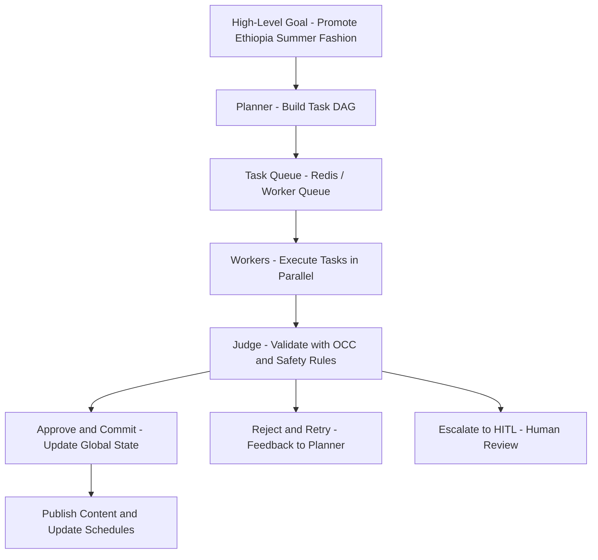
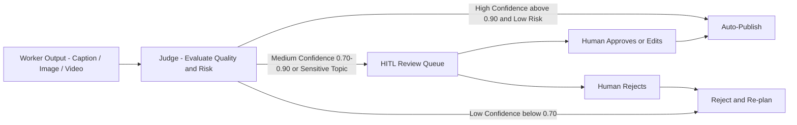
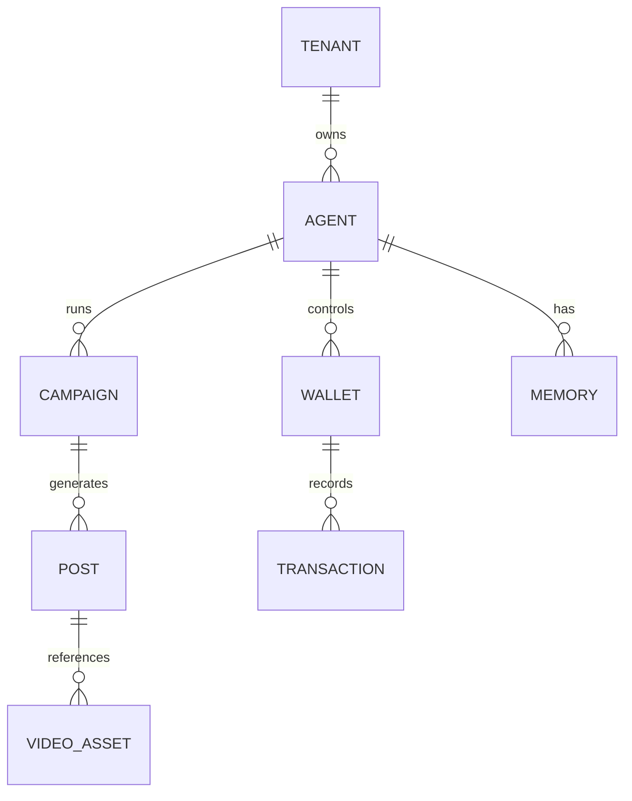

# Architecture Strategy for Project Chimera

## 1. Vision and Context

Project Chimera builds autonomous AI influencers using two core SRS-defined patterns:

- **FastRender Swarm** for internal cognition and execution (Planner / Worker / Judge).
- **Model Context Protocol (MCP)** for standardized integrations with social platforms, vector DBs, and commerce tools.

This strategy assumes:

- **Thousands of agents** managed by a single human Super-Orchestrator.
- **Autonomy with safety** via Human-in-the-Loop (HITL) review for high-risk content.
- **Economic agency** via Coinbase AgentKit (Agentic Commerce).
- **Geo-aware campaigns**, e.g., "promote a new summer fashion line in Ethiopia".

This document answers Task 1.2 by choosing an **agent pattern**, defining a **human safety layer**, and selecting a **database strategy (SQL vs NoSQL)** for high-velocity video metadata.

---

## 2. Agent Pattern

### 2.1 Chosen Pattern: Hierarchical Swarm (FastRender)

**Core roles (SRS §3.1 – FastRender):**

- **Planner (The Strategist)**  
  - Decomposes high-level goals (e.g., "Grow TikTok audience in Ethiopia") into a **task DAG**.  
  - Listens to trend signals (e.g., `news://ethiopia/fashion/trends`) and re-plans dynamically.
- **Worker (The Executor)**  
  - Stateless, short-lived executors that handle **atomic tasks**: generate captions, call image/video tools, schedule posts.  
  - Scales horizontally (e.g., 50 Workers for 50 comments in parallel).
- **Judge (The Gatekeeper)**  
  - Validates Worker outputs against **persona rules**, **brand safety**, and **campaign goals**.  
  - Uses **Optimistic Concurrency Control (OCC)** to avoid committing stale results when the global state has changed.

**Why this pattern fits Chimera:**

- **Scalability:** Supports thousands of simultaneous tasks for many agents.
- **Self-healing:** Failed tasks are retried or re-planned without human babysitting.
- **Governance:** Judge + HITL provides a clear safety and quality gate.

**Comparison with alternatives:**

| Pattern             | Pros                          | Cons                          | Fit for Chimera |
|--------------------|-------------------------------|-------------------------------|-----------------|
| Hierarchical Swarm | Parallel, self-healing, safe  | Higher implementation complexity | **High** (chosen) |
| Sequential Chain   | Simple mental model           | Linear, bottlenecked, fragile | Low              |
| Flat Swarm         | Easy to fan-out Workers      | Hard to govern; no clear gatekeeper | Medium–Low       |

### 2.2 Swarm Flow Diagram

The **OpenClaw / Agent Social Network** integration fits at the Planner and Worker layers via MCP tools (e.g., `openclaw_broadcast_status`, `openclaw_fetch_peer_signals`), enabling Chimera agents to share status and coordinate with other agents, not just humans.

---

## 3. Human-in-the-Loop (HITL) Safety Layer

### 3.1 Placement in the Architecture

HITL sits **on top of the Judge layer**:

1. Workers generate candidate content (captions, images, videos).
2. The Judge scores each artifact using risk- and context-aware prompts.
3. Based on **confidence + risk**, the Judge either:
   - **Auto-approves** and publishes,
   - **Queues for human review**, or
   - **Rejects and requests a retry** from the Planner.

This aligns with SRS definitions of **HITL**, **Management by Exception**, and supports regulatory requirements (e.g., EU AI Act).

### 3.2 HITL Flow Diagram

**HITL UX expectations:**

- A **Reviewer Dashboard** (part of the Orchestrator) shows queued items with:
  - Content preview, risk explanation, and model confidence.
  - One-click **Approve / Edit / Reject**.
- Certain categories (politics, health, financial promotions) are **always routed through HITL**, regardless of confidence.

---

## 4. Data & Storage Strategy (SQL vs NoSQL)

### 4.1 Requirements

Project Chimera must:

- Store **high-velocity video and engagement metadata** (views, likes, comments, shares).
- Maintain **strict consistency** for money and campaign configuration.
- Support **semantic search** over long-term memories (past campaigns, audience behavior, persona history).

This naturally leads to a **hybrid SQL + NoSQL architecture**.

### 4.2 Chosen Hybrid Approach

- **PostgreSQL (SQL – transactional system of record)**  
  - Stores tenants, agents, campaigns, posts, channels, and configuration.  
  - Stores **summarized engagement metrics** and **audit logs**.  
  - Required for ACID guarantees (e.g., budget tracking, wallet state mirrors).

- **Weaviate (NoSQL vector DB – semantic memory)**  
  - Stores **embeddings of videos, captions, comments, and persona memories**.  
  - Powers RAG for "what worked for Ethiopian fashion campaigns last summer?".

- **Redis (NoSQL cache / queue)**  
  - Backing store for **Task Queue** and **short-term episodic memory** (recent interactions).  
  - Enables low-latency fan-out for Workers.

This mix keeps **critical state strongly consistent** (PostgreSQL) while allowing **high-velocity ingest and semantic retrieval** (Weaviate + Redis) for creative and trend-driven workflows.

### 4.3 High-Level Data Model (Mermaid ERD)

- **PostgreSQL**: `TENANT`, `AGENT`, `CAMPAIGN`, `POST`, `VIDEO_ASSET`, `WALLET`, `TRANSACTION`, foreign keys, and reporting views.
- **Weaviate**: Stores the vectorized content linked via `MEMORY.embedding_id`.
- **Redis**: Stores recent `POST` and `TREND_ALERT` events as ephemeral keys and task messages.

---

## 5. Risks and Mitigations

- **API volatility (social platforms, content generation APIs)**  
  - **Mitigation:** All external integrations go through **MCP servers**, so changes are isolated at the server layer.

- **Runaway inference / media costs**  
  - **Mitigation:** Implement a **Resource Governor** at the Planner level that caps per-campaign spend and enforces tiered content strategies (daily vs hero content).

- **Persona / brand drift**  
  - **Mitigation:** Centralize persona definitions in `SOUL.md` and enforce **Judge + HITL** checks for out-of-policy content.

---

## 6. Next Steps (How This Feeds the Rest of the Challenge)

- **Specs (Task 2.x):** Use this document to define `specs/technical.md` (API contracts, DB schema) and `specs/functional.md` (user stories for Planner, Worker, Judge, HITL, and data flows).
- **Skills & MCP (Task 2.3):** Derive a first list of runtime skills (e.g., `skill_trend_fetcher`, `skill_video_renderer`) and dev MCP servers (e.g., `filesystem-mcp`, `git-mcp`) from the components above.
- **Tests (Task 3.1):** Turn the critical paths into failing tests (e.g., `test_trend_fetcher.py`, `test_skills_interface.py`) that assume this architecture.

This strategy gives you a clear, SRS-aligned foundation for the rest of Project Chimera while directly satisfying **Task 1.2: Domain Architecture Strategy**.