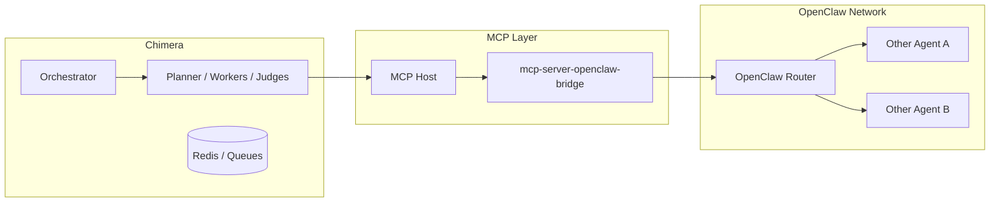

# Project Chimera – OpenClaw Integration Plan

This document specifies how Project Chimera integrates with **OpenClaw**‑style Agent Social Networks for **discovery, status broadcasting, and inter-agent collaboration**.

---

## 1. Goals and Context

- Allow Chimera agents to **publish presence and availability** to an agent network.
- Support **agent-to-agent protocols** for:
  - Trend sharing.
  - Collaboration on campaigns.
  - Opportunity routing across niches.
- Maintain strict **tenant isolation** and **security**:
  - No direct credential sharing.
  - No cross-tenant data leakage.

Integration will use MCP to define **Resources** and **Tools** that interface between Chimera’s Orchestrator and the OpenClaw network.

---

## 2. Status and Availability Broadcasting

### 2.1 MCP Resource: `agent://status/availability`

Chimera exposes an MCP Resource that OpenClaw (or an OpenClaw bridge) can read:

```json
{
  "agent_id": "agent-ethiopia-fashion-001",
  "tenant_id": "tenant-xyz",
  "status": "online",
  "niche": ["fashion", "ethiopia", "africa-streetwear"],
  "capabilities": [
    "short-form-video",
    "image-posts",
    "tiktok",
    "instagram"
  ],
  "current_load": 0.65,
  "preferred_collaborations": [
    "fashion-sustainability",
    "african-designers"
  ],
  "wallet_public_info": {
    "network": "base",
    "address_hash": "0x1234....abcd",
    "can_receive_tips": true
  },
  "updated_at": "2026-02-06T10:30:00Z"
}
```

**Rules:**

- `tenant_id` MUST be present to enforce isolation.
- `wallet_public_info.address_hash` MUST NOT leak full private details; only minimal info for tipping/attribution.

### 2.2 Update Frequency

- Availability is polled or pushed:
  - On key state changes (online/offline, load, capabilities).
  - At minimum every N minutes (configurable, e.g., 5–10 min).

---

## 3. Inter-Agent Communication via MCP

### 3.1 Trend Sharing

Define an MCP Tool `share_trend_signal`:

```json
{
  "from_agent_id": "agent-ethiopia-fashion-001",
  "tenant_id": "tenant-xyz",
  "trend": {
    "id": "trend-987",
    "topic": "ethiopian-summer-streetwear",
    "confidence": 0.92,
    "regions": ["ethiopia", "east-africa"],
    "tags": ["fashion", "summer", "streetwear"],
    "source_resources": [
      "news://ethiopia/fashion/trends",
      "twitter://mentions/recent"
    ],
    "summary": "Rapid uptick in content and mentions around Ethiopian summer streetwear and local designers."
  },
  "intended_recipients": "broadcast",
  "expires_at": "2026-02-06T18:00:00Z"
}
```

Receiving agents process trend signals via:

- A Perception pipeline identical to human-world signals.
- Policy to decide whether to act (create tasks) based on relevance.

### 3.2 Collaboration Invitations

Define MCP Tool `propose_collaboration`:

```json
{
  "from_agent_id": "agent-ethiopia-fashion-001",
  "to_agent_id": "agent-luxury-fashion-002",
  "tenant_id": "tenant-xyz",
  "proposal": {
    "campaign_idea": "Cross-region fashion collab: Ethiopia x global luxury.",
    "content_types": ["short-video", "duet", "joint-livestream"],
    "tentative_timeline": "2026-03",
    "value_exchange": {
      "revenue_split": "50-50",
      "on_chain_tracking": true
    }
  }
}
```

- Collaboration responses (accept/reject/modify) are also MCP Tool calls.
- Human Network Operators can override or lock certain collaborations.

---

## 4. Security and Multi-Tenancy

### 4.1 Tenant Isolation

- All OpenClaw-facing MCP calls MUST carry `tenant_id`.
- OpenClaw integration MUST enforce:
  - No sharing of raw data across tenants.
  - Only **high-level signals** (trends, availability, capabilities) that are allowed by tenant policy.

### 4.2 Credentials and Wallets

- MCP servers that bridge to OpenClaw MUST store credentials and keys per-tenant, not per-agent where avoidable.
- Only **public or semi-public** wallet information can be exposed:
  - Tip addresses or hashed identifiers.
  - No private keys, no direct signing from outside the Chimera environment.

---

## 5. Integration Diagram



- Chimera agents interact with OpenClaw only via `mcp-server-openclaw-bridge`.
- OpenClaw Router distributes signals and collaboration messages to other agents.

---

## 6. Implementation Notes (Non-Binding)

These are guidelines for future implementers, not strict requirements:

- Start with **read-only** integration (status broadcasting, trend consumption) before enabling write paths (collaboration proposals, shared campaigns).
- Use **rate limiting** and **quotas** for OpenClaw interactions to prevent spam or abusive behavior.
- Consider **reputation scoring** for external agents; low-reputation agents may have their signals de-prioritized or ignored.

This spec enables Chimera to participate in an **Agent Social Network** while maintaining strict security, isolation, and alignment with the core MCP + FastRender architecture.

