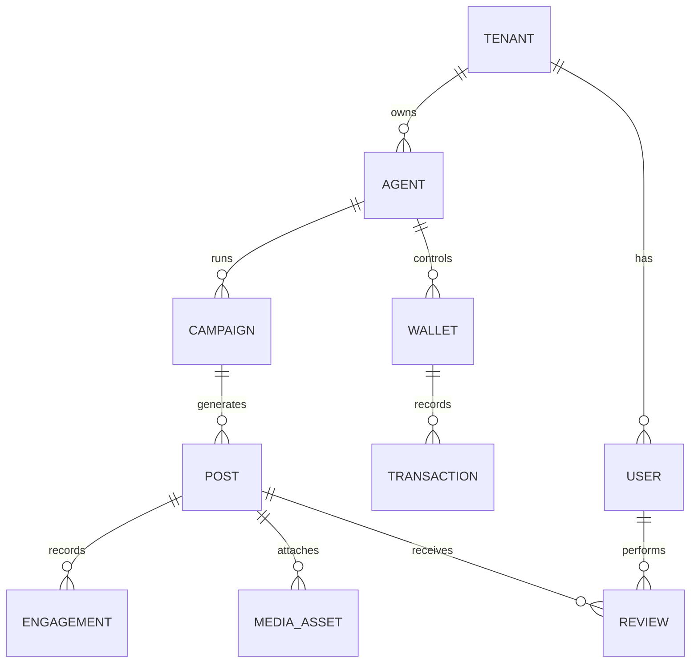

# Project Chimera – Technical Specification

This document defines key **API contracts**, **data schemas**, and **infrastructure topology** for Project Chimera.

---

## 1. System Topology and Tech Stack (SRS §2.1–2.3, §3.2)

### 1.1 High-Level Architecture

- **Compute**: Kubernetes (AWS/GCP) for containerized workloads; auto-scaling for viral spikes.
- **LLMs**:
  - High-complexity reasoning: Gemini 3 Pro or Claude Opus.
  - High-volume tasks: Gemini 3 Flash or Haiku.
- **Data layer**:
  - PostgreSQL – transactional data (tenants, agents, campaigns, posts, wallets, logs).
  - Weaviate – vector store for semantic memories.
  - Redis – episodic cache and task queues.
  - Blockchain ledgers (Base/Ethereum/Solana) for on-chain transactions.
- **Integration Layer**: MCP as Hub-and-Spoke:
  - MCP Host embedded in agent runtime.
  - MCP Servers for social platforms, Weaviate, Coinbase AgentKit, etc.

---

## 2. API Contracts

### 2.1 Task Payload from Planner → Worker

Planner outputs **Tasks** into the Task Queue. Each Task is a JSON object:

```json
{
  "task_id": "uuid-1234",
  "task_type": "generate_caption",
  "priority": "high",
  "agent_id": "agent-ethiopia-fashion-001",
  "tenant_id": "tenant-xyz",
  "goal": {
    "campaign_id": "cmp-summer-ethiopia-2026",
    "goal_description": "Promote the new Ethiopian summer fashion line on TikTok.",
    "success_criteria": [
      "High engagement rate",
      "On-brand tone",
      "Compliance with persona directives"
    ]
  },
  "persona_constraints": {
    "voice": ["witty", "aspirational"],
    "forbidden_topics": ["politics", "explicit content"],
    "tone_notes": "Highlight local designers and sustainable fabrics."
  },
  "context": {
    "trend_alert_ids": ["trend-987"],
    "recent_posts": [
      {
        "post_id": "post-123",
        "platform": "tiktok",
        "summary": "Showcasing Addis Ababa street style."
      }
    ]
  },
  "required_resources": [
    "news://ethiopia/fashion/trends",
    "twitter://mentions/recent"
  ],
  "created_at": "2026-02-06T10:00:00Z",
  "deadline": "2026-02-06T10:05:00Z"
}
```

Constraints:

- `task_type` must be from a controlled enum (e.g., `generate_caption`, `render_image`, `publish_post`).
- `tenant_id` is mandatory for multi-tenancy isolation.
- `goal` and `persona_constraints` must be sufficient for deterministic behavior.

### 2.2 Worker → Judge Artifact Contract

Workers produce **Artifacts** for Judges to validate:

```json
{
  "artifact_id": "art-5678",
  "task_id": "uuid-1234",
  "agent_id": "agent-ethiopia-fashion-001",
  "tenant_id": "tenant-xyz",
  "artifact_type": "caption",
  "payload": {
    "text": "Step into Ethiopia's summer in style 🇪🇹✨ Discover local designers redefining street fashion.",
    "platform": "tiktok",
    "hashtags": ["#EthiopiaFashion", "#SummerDrop", "#LocalDesigners"]
  },
  "generation_metadata": {
    "model": "gemini-3-pro",
    "temperature": 0.7,
    "prompt_version": "caption_v2"
  },
  "state_snapshot_version": 42,
  "created_at": "2026-02-06T10:00:10Z"
}
```

Judges must:

- Validate `state_snapshot_version` using OCC:
  - If global campaign state version > `state_snapshot_version` and relevant fields changed, invalidate artifact.
- Evaluate safety, persona alignment, and goal fit.

### 2.3 Judge → HITL Review Queue Item

When escalation is required:

```json
{
  "review_id": "rev-1122",
  "artifact_id": "art-5678",
  "task_id": "uuid-1234",
  "agent_id": "agent-ethiopia-fashion-001",
  "tenant_id": "tenant-xyz",
  "content_preview": {
    "type": "caption",
    "text": "Step into Ethiopia's summer in style 🇪🇹✨ Discover local designers redefining street fashion."
  },
  "confidence_score": 0.78,
  "risk_category": "brand_safety_medium",
  "reason_for_escalation": [
    "New political keyword cluster detected in related trend alerts.",
    "Confidence below auto-approval threshold for this campaign."
  ],
  "suggested_actions": ["approve", "edit", "reject"],
  "created_at": "2026-02-06T10:00:12Z",
  "expires_at": "2026-02-06T11:00:00Z"
}
```

The HITL UI consumes this contract.

### 2.4 MCP Tool: `post_content`

Standardized MCP Tool payload for publishing content:

```json
{
  "platform": "tiktok",
  "tenant_id": "tenant-xyz",
  "agent_id": "agent-ethiopia-fashion-001",
  "content": {
    "text": "Step into Ethiopia's summer in style 🇪🇹✨ Discover local designers redefining street fashion.",
    "media_ids": ["media-991"],
    "reply_to_id": null
  },
  "disclosure": {
    "ai_generated": true,
    "sponsor": "Brand ABC",
    "compliance_tags": ["ad"]
  },
  "scheduling": {
    "mode": "scheduled",
    "publish_at": "2026-02-06T17:30:00Z"
  },
  "tracking": {
    "campaign_id": "cmp-summer-ethiopia-2026",
    "task_id": "uuid-1234",
    "source": "chimera_orchestrator"
  }
}
```

### 2.5 MCP Tool: `send_transaction` (Agentic Commerce)

```json
{
  "tenant_id": "tenant-xyz",
  "agent_id": "agent-ethiopia-fashion-001",
  "wallet_id": "wallet-abc",
  "network": "base",
  "asset": "USDC",
  "amount": "25.00",
  "to_address": "0x1234abcd...",
  "purpose": "pay_for_video_generation",
  "budget_guard": {
    "campaign_id": "cmp-summer-ethiopia-2026",
    "max_per_tx": "50.00",
    "max_daily": "200.00"
  },
  "metadata": {
    "task_id": "uuid-1234"
  }
}
```

Judges / Resource Governor must approve or deny based on policies.

---

## 3. Data Model and Storage

### 3.1 Hybrid Storage Strategy

- **PostgreSQL**:
  - Tenants, Agents, Campaigns, Posts, Wallets, Transactions, Audit Logs.
  - Strong consistency and relational integrity.

- **Weaviate**:
  - Vectorized memories (posts, comments, trend alerts, persona evolutions).
  - Used in RAG loops for reasoning and personalization.

- **Redis**:
  - Short-term episodic memory (recent interactions).
  - Task queues for Planner ↔ Worker ↔ Judge.

### 3.2 ER Diagram (Relational Core)



**Table notes (PostgreSQL):**

- `TENANT`:
  - `id`, `name`, `created_at`, `status`
- `AGENT`:
  - `id`, `tenant_id`, `name`, `persona_ref` (path to SOUL.md), `status`
- `CAMPAIGN`:
  - `id`, `tenant_id`, `agent_id`, `name`, `objective`, `budget`, `status`
- `POST`:
  - `id`, `tenant_id`, `agent_id`, `campaign_id`, `platform`, `status`, `published_at`
- `ENGAGEMENT`:
  - `id`, `post_id`, `views`, `likes`, `comments`, `shares`, `captured_at`
- `MEDIA_ASSET`:
  - `id`, `post_id`, `type` (image/video), `storage_url`, `character_reference_id`
- `WALLET`:
  - `id`, `tenant_id`, `agent_id`, `network`, `address`
- `TRANSACTION`:
  - `id`, `wallet_id`, `tx_hash`, `direction`, `amount`, `asset`, `purpose`, `created_at`
- `USER`:
  - `id`, `tenant_id`, `role` (network_operator, reviewer, admin), `email`
- `REVIEW`:
  - `id`, `post_id`, `user_id`, `decision` (approve/edit/reject), `notes`, `created_at`

### 3.3 Memory and Vector Store Mapping

Weaviate will store memories linked back to relational IDs:

- Weaviate class: `Memory`
  - Fields:
    - `memory_id` (string, mirrors PostgreSQL ID if needed)
    - `tenant_id`
    - `agent_id`
    - `source_type` (post, comment, trend_alert, conversation)
    - `source_id` (e.g., `post.id` or `trend_alert.id`)
    - `text` (raw or summarized content)
    - `timestamp`
    - `embedding` (vector)

---

## 4. MCP Topology and Servers (SRS §3.2)

### 4.1 MCP Host

- Runs in each Agent runtime pod.
- Discovers and connects to available MCP Servers via:
  - stdio (local).
  - SSE / HTTP (remote).

### 4.2 Core MCP Servers

- `mcp-server-twitter` (or equivalent for X)
  - Resources: `twitter://mentions/recent`, `twitter://user/{id}/profile`
  - Tools: `post_tweet`, `reply_to_tweet`
- `mcp-server-weaviate`
  - Tools: `search_memory`, `upsert_memory`
- `mcp-server-coinbase`
  - Tools: `create_wallet`, `send_transaction`, `get_balance`
- `mcp-server-news`
  - Resources: `news://ethiopia/fashion/trends`, `news://{region}/{topic}/trends`

---

## 5. Non-Functional Technical Requirements

- **Latency**:
  - Worker execution for simple tasks (caption generation) SHOULD complete within 1–3 seconds.
- **Throughput**:
  - System SHOULD support thousands of concurrent workers across tenants.
- **Reliability**:
  - Use retries with backoff for transient MCP failures.
  - Self-healing workflows must auto-recover from most transient errors.

These technical contracts and schemas are the **source of truth** for implementation, tests, and AI agents that will build out the system.

